# MiWiFi for Home Assistant

The component allows you to monitor devices and manage routers based on [MiWiFi](http://miwifi.com/) from [Home Assistant](https://www.home-assistant.io/).

❗ Supports routers with original or original patched MiWifi firmware

❗ On the modified firmware, not all functionality may work

## More info
- [Install](https://github.com/JuanManuelRomeroGarcia/hass-miwifi/wiki/Install)
- [Config](https://github.com/JuanManuelRomeroGarcia/hass-miwifi/wiki/Config)
  - [Advanced config](https://github.com/JuanManuelRomeroGarcia/hass-miwifi/wiki/Config#advanced-config)
    - [Automatically remove devices](https://github.com/JuanManuelRomeroGarcia/hass-miwifi/wiki/Config#automatically-remove-devices)
- [Supported routers](#supported-routers)
  - [Check list](#check-list)
    - [Required](#required)
    - [Additional](#additional)
    - [Action](#action)
  - [Summary](#summary)
- [Conflicts](https://github.com/JuanManuelRomeroGarcia/hass-miwifi/wiki/Conflicts)
- [Entities](https://github.com/JuanManuelRomeroGarcia/hass-miwifi/wiki/Entities)
- [Services](https://github.com/JuanManuelRomeroGarcia/hass-miwifi/wiki/Services)
  - [Calculate passwd](https://github.com/JuanManuelRomeroGarcia/hass-miwifi/wiki/Services#calculate-passwd)
  - [Send request](https://github.com/JuanManuelRomeroGarcia/hass-miwifi/wiki/Services#send-request)
- [Events](https://github.com/JuanManuelRomeroGarcia/hass-miwifi/wiki/Events)
  - [Luci response](https://github.com/JuanManuelRomeroGarcia/hass-miwifi/wiki/Events#luci-response)
- [Performance table](https://github.com/JuanManuelRomeroGarcia/hass-miwifi/wiki/Performance-table)
- [Example automation](https://github.com/JuanManuelRomeroGarcia/hass-miwifi/wiki/Example-automation)
  - [Device blocking](https://github.com/JuanManuelRomeroGarcia/hass-miwifi/wiki/Example-automation#device-blocking)
  - [Lighting automation](https://github.com/JuanManuelRomeroGarcia/hass-miwifi/wiki/Example-automation#lighting-automation)
- [Diagnostics](https://github.com/JuanManuelRomeroGarcia/hass-miwifi/wiki/Diagnostics)
- [FAQ](https://github.com/JuanManuelRomeroGarcia/hass-miwifi/wiki/FAQ)

## Supported routers

MiWiFi recognizes many Xiaomi and Redmi router models. Available features depend
on the model, firmware and network configuration.

### Summary

Router photos and model codes from the historical MiWiFi list. This gallery does not
confirm that every feature works with every firmware version. The integration checks
the APIs available on each router during setup.

| Image | Router | Code |
| --- | --- | --- |
| 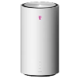 | Xiaomi 5G CPE Pro | CB0401 |
|  | Mi Router 4A Gigabit V2 | R4AV2 |
| 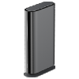 | Xiaomi Home WiFi | RB08 |
| 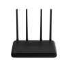 | Redmi Router AX6000 | RB06 |
| 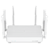 | Redmi Router AX5400 | RA74 |
| 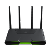 | Redmi Gaming Router AX5400 | RB04 |
| 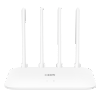 | Xiaomi Router AC1200 | RB02 |
| 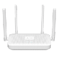 | Xiaomi Router CR8808 | CR8808 |
|  | Xiaomi Mesh System AX3000 | RA82 |
|  | Xiaomi Router AX3200 | RB01 |
| 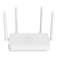 | Redmi Router AX1800 | RA71 |
| 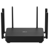 | Redmi Router AX6S | RB03 |
| 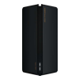 | Xiaomi Router AX3000 | RA80 |
| 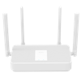 | Redmi Router AX3000 | RA81 |
| 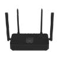 | Xiaomi China Unicom WiFi 6 Router | CR6606 |
| 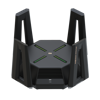 | Xiaomi Router AX9000 | RA70 |
|  | Redmi Router AX5 | RA50 |
|  | Xiaomi Router AX6000 | RA72 |
| 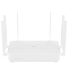 | Redmi Router AX6 | RA69 |
| 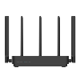 | Mi Router 4 Pro | R1350 |
| 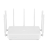 | Mi AIoT Router AC2350 | R2350 |
| 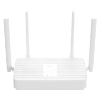 | Redmi Router AX5 | RA67 |
| 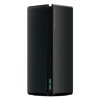 | Mi Router AX1800 | RM1800 |
| 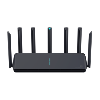 | Xiaomi AIoT Router AX3600 | R3600 |
| 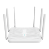 | Redmi Router AC2100 | RM2100 |
| 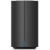 | Mi Router AC2100 | R2100 |
| 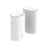 | Mi Router Mesh | D01 |
|  | Mi Router 4A | R4AC |
| 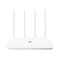 | Mi Router 4A Gigabit | R4A |
| 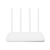 | Mi Router 4C | R4CM |
| 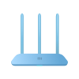 | Mi Router 4Q | R4C |
| 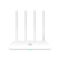 | Mi Router 4 | R4 |
| 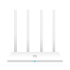 | Mi Router 3A | R3A |
|  | Mi Router 3C | R3L |
| 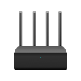 | Mi Router HD | R3D |
|  | Mi Router Pro | R3P |
| 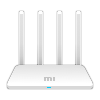 | Mi Router 3G | R3G |
|  | Mi Router 3 | R3 |
| 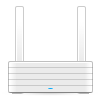 | Mi Router R2D | R2D |
| 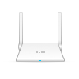 | Mi Router Lite | R1CL |
| 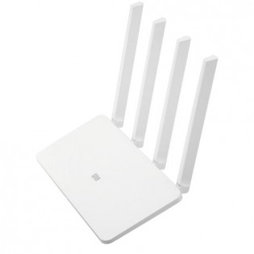 | Mi Router Mini | R1CM |
| 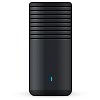 | Mi Router R1D | R1D |
|  | Xiaomi Mi Router BE3600 2.5G | RD15 |
| 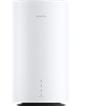 | Xiaomi 5G CPE Pro CB0401V2 | CB0401V2 |
| 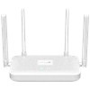 | Xiaomi Mi Router CR8816 | CR8816 |
| 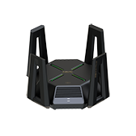 | Mi Router 10000 | RC01 |
| 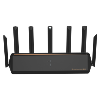 | Xiaomi Router BE7000 | RC06 |
| 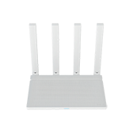 | Xiaomi Router AX3000T | RD03 |
| 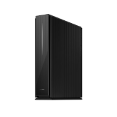 | Xiaomi Router 6500 Pro | RD08 |
| 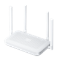 | Xiaomi Router AX1500 EU | RD12 |
| 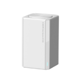 | Xiaomi Mesh System AC1200 | RD13 |
| 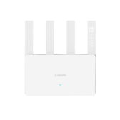 | Xiaomi BE3600 Gigabit | RD16 |
| 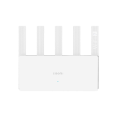 | Xiaomi Router BE5000 | RD18 |
| 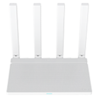 | Xiaomi Router AX3000T EU | RD23 |
| 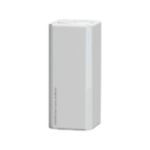 | Xiaomi Mesh AX3000 NE | RD28 |
| 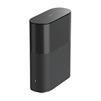 | Xiaomi Router BE3600 Pro Black | RN01 |
| 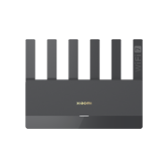 | Xiaomi Router BE6500 | RN02 |
| 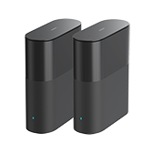 | Xiaomi Whole House BE3600 Pro Master | RN04 |
| 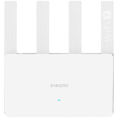 | Xiaomi Router BE3600 2.5G Global | RN06 |
| 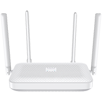 | Xiaomi Router AX1500 | RD04v2 |
|  | Xiaomi Router AX3000T | RN07 |
|  | Xiaomi 4A Gigabit Edition | R4ACv2 |
|  | Xiaomi Router AX3000 NE | RC02 |
|  | Xiaomi BE10000 Pro | RP04 |
|  | Xiaomi Router AX3000T (Qualcomm version) | RD03V2 |
|  | Xiaomi Whole House Router BE3600 Pro Wired (5-port main router) | RP01 |
|  | Xiaomi Whole House Router BE3600 Pro Wired (satellite router) | RP03 |

### Check list

##### Required
- `xqsystem/login` - Authorization;
- `xqsystem/init_info` - Basic information about the router;
- `misystem/status` - Basic information about the router. Diagnostic data, memory, temperature, etc;
- `xqnetwork/mode` - Operating mode. Repeater, Access Point, Mesh, etc.
- `xqnetwork/get_netmode` - Operating mode. Repeater, Access Point, Mesh, etc.

##### Additional
- `misystem/topo_graph` - Topography, auto discovery does not work without it;
- `xqsystem/check_rom_update` - Getting information about a firmware update;
- `xqnetwork/wan_info` - WAN port information;
- `xqsystem/vpn_status` - Information about vpn connection;
- `misystem/led` - Interaction with LEDs;
- `xqnetwork/wifi_detail_all` - Getting information about WiFi adapters;
- `xqnetwork/wifi_diag_detail_all` - Getting information about guest WiFi;
- `xqnetwork/avaliable_channels` - Gets available channels for WiFi adapter;
- `xqnetwork/wifi_connect_devices` - Get information about connected devices;
- `misystem/devicelist` - More information about connected devices;
- `xqnetwork/wifiap_signal` - AP signal in repeater mode;
- `misystem/newstatus` - Additional information about connected devices for force load mode.

##### Action
- `xqsystem/reboot` - Reboot;
- `xqsystem/upgrade_rom` - Firmware update;
- `xqsystem/flash_permission` - Clear permission. Required only for firmware updates;
- `xqnetwork/set_wifi` - Update WiFi settings. Causes the adapter to reboot;
- `xqnetwork/set_wifi_without_restart` - Update Guest WiFi settings.

❗ If your router is not listed or not tested, try adding an integration, it will check everything and give a link to create an issue. You just have to click `Submit new issue`

❗ If at the time of adding the integration only `Router {ip} not supported` message is displayed, please create an issue with the message that the router is not supported, indicating the model of the router.

## Integrated frontend panel

As of version **v3.7.0**, the MiWiFi frontend panel is included in this integration and is automatically installed via HACS. There is no need to install a separate panel or manually add resources.

The standalone [miwifi-panel-frontend](https://github.com/JuanManuelRomeroGarcia/miwifi-panel-frontend) repository remains for historical reference regarding older installations; new installations should use this repository.
